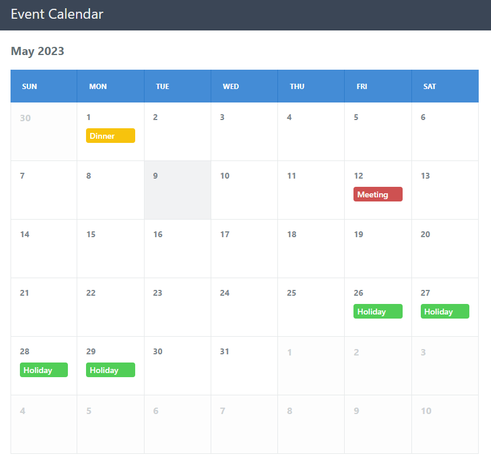

 
# Event Calendar with PHP

## Reference
<a href="https://codeshack.io/event-calendar-php/" target="_blank">Event Calendar with PHP</a>

## Using docker to setup the PHP Web Server
<pre>
docker run --name event_calendar --volume=D:\Event_Calendar\html:/var/www/html --workdir=/var/www/html -p 80:80 --restart=no --runtime=runc -d php:8.0.27-apache
</pre>

## Screenshot

